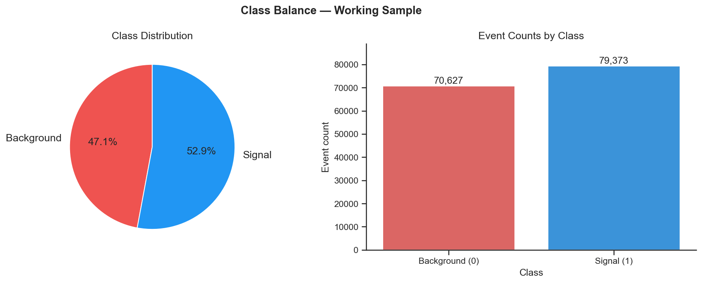
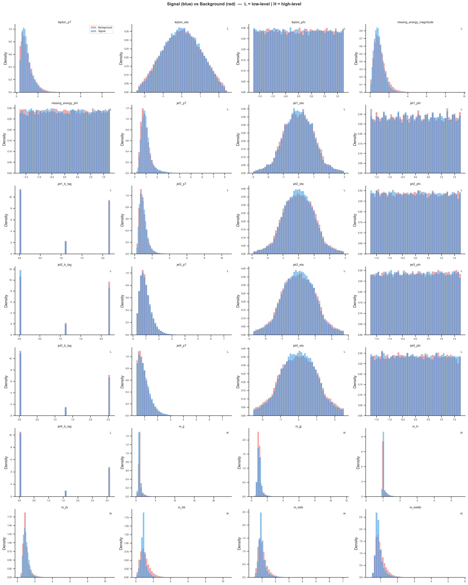
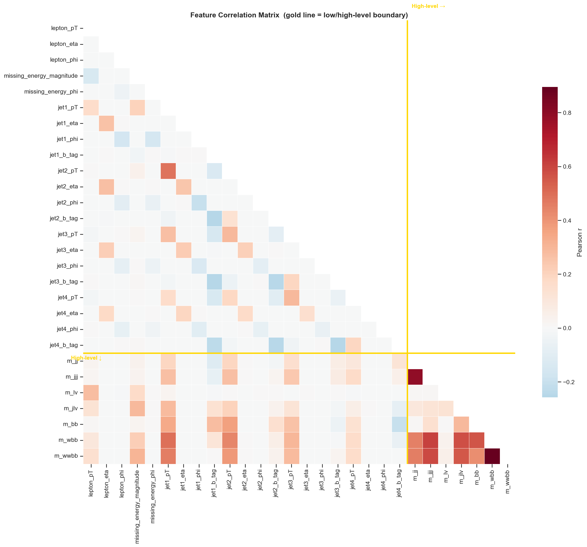
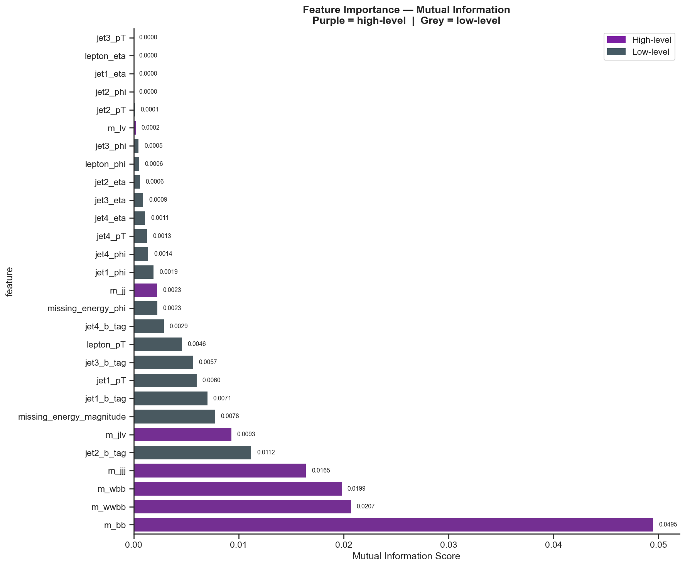
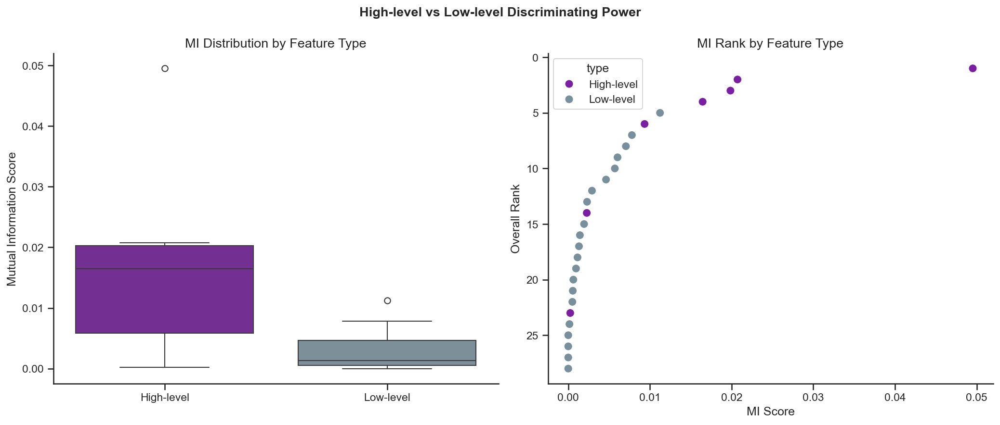
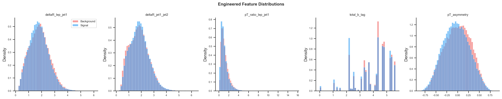
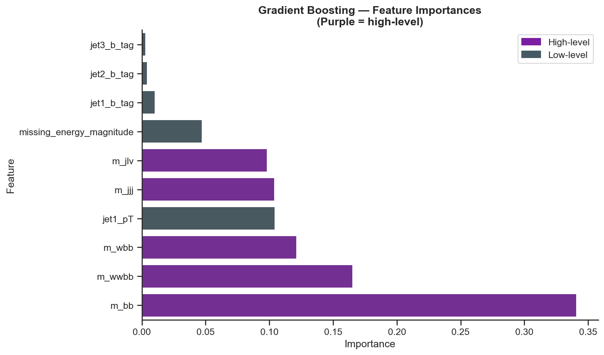
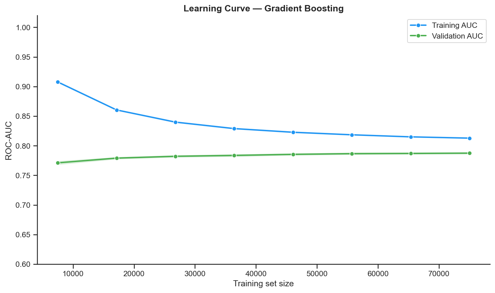
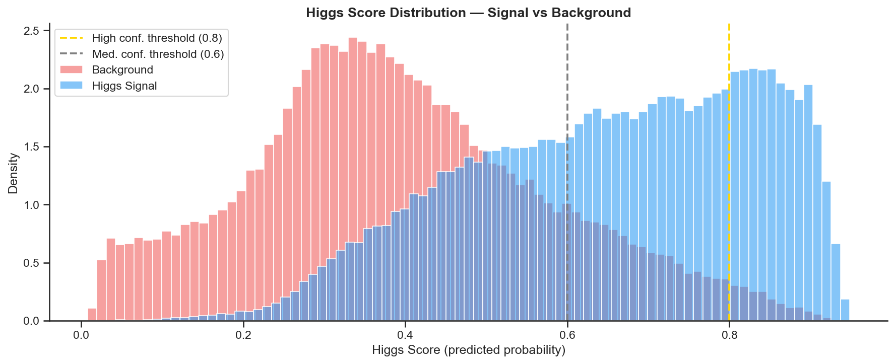

# Higgs Boson Discovery — End-to-End EDA & Classification

> Distinguishing Higgs boson signal events from background noise using 28 physics features from 11M simulated LHC collisions.

**Dataset:** HIGGS UCI (Baldi et al., *Nature Communications*, 2014)  
**Sample:** 150,000 events · 52.9% signal / 47.1% background  
**Stack:** Python 3.11 · scikit-learn · pandas · seaborn · uv

---

## Table of Contents

1. [Physics Context](#1-physics-context)
2. [Dataset](#2-dataset)
3. [Key Findings](#3-key-findings)
4. [Feature Analysis](#4-feature-analysis)
5. [Model Results](#5-model-results)
6. [Signal Extraction](#6-signal-extraction)
7. [Reproducing the Analysis](#7-reproducing-the-analysis)

---

## 1. Physics Context

The **Higgs boson** is the particle responsible for giving other particles their mass, predicted by the Standard Model and discovered at CERN's Large Hadron Collider in 2012 (Nobel Prize, 2013). Identifying it in collision data is a classification problem: every proton–proton collision either produced a Higgs boson (signal) or mimicked one through other processes (background).

---

## 2. Dataset

| Property | Value |
| --- | --- |
| Source | UCI ML Repository — Baldi et al. (2014) |
| Total events | 11,000,000 |
| Working sample | 150,000 (fixed seed, stratified) |
| Features | 28 (21 low-level + 7 high-level) |
| Missing values | 0 |
| Duplicate rows | 52 |

### Feature Groups

| Group | Count | Description |
| --- | --- | --- |
| **Low-level** | 21 | Raw detector measurements: transverse momenta (pT), pseudorapidity (η), azimuthal angle (φ), b-tagging scores for the lepton and 4 jets |
| **High-level** | 7 | Physicist-engineered invariant masses: `m_jj`, `m_jjj`, `m_lv`, `m_jlv`, `m_bb`, `m_wbb`, `m_wwbb` |

### Class Balance



The working sample is **near-balanced** (signal/background ratio = 1.124). Standard accuracy is a valid primary metric; no resampling was needed.

---

## 3. Key Findings

### Finding 1 — High-level features dominate (6.3× more informative)

This directly confirms the central claim of Baldi et al. (2014):

| Feature Type | Mean MI | Median MI | Max MI |
| --- | --- | --- | --- |
| **High-level** | **0.0169** | 0.0165 | 0.0495 |
| Low-level | 0.0027 | 0.0011 | 0.0112 |

`m_bb` (MI = 0.0495) carries **4× more** discriminating power than the best low-level feature (`jet2_b_tag`, MI = 0.0112). Four of the top 5 MI slots are occupied by high-level features.

### Finding 2 — Statistical separability is strong

7 of the top 8 MI-ranked features exceed CERN's 5σ discovery threshold:

| Feature | Z-score | Type |
| --- | --- | --- |
| `m_bb` | **57.5σ** | High-level |
| `m_wwbb` | 47.9σ | High-level |
| `missing_energy_magnitude` | 37.8σ | Low-level |
| `m_wbb` | 24.6σ | High-level |
| `jet2_b_tag` | 20.3σ | Low-level |
| `m_jlv` | 10.8σ | High-level |
| `m_jjj` | 9.4σ | High-level |
| `jet1_b_tag` | 2.8σ *(below threshold)* | Low-level |

### Finding 3 — Gradient Boosting beats Random Forest; both far exceed linear models

| Model | CV ROC-AUC | CV Accuracy |
| --- | --- | --- |
| **Gradient Boosting** | **0.7900 ± 0.0017** | 0.7140 ± 0.0020 |
| Random Forest | 0.7866 ± 0.0021 | 0.7112 ± 0.0019 |
| Logistic Regression | 0.6766 ± 0.0034 | 0.6379 ± 0.0033 |

The GB–LR gap (~0.113 AUC) confirms that decision boundaries in this problem are strongly non-linear.

---

## 4. Feature Analysis

### Distributions — Signal vs Background



Each panel shows normalised density for signal (blue) and background (red). **L** = low-level, **H** = high-level. High-level features show the sharpest separation, especially `m_bb` and `m_wwbb`.

### Correlation Structure



The gold line marks the boundary between low-level and high-level features. Notable high correlations within the high-level group:
- `m_wbb` ↔ `m_wwbb`: r = 0.895
- `m_jj` ↔ `m_jjj`: r = 0.795

These encode overlapping decay topologies; a regularised model suppresses one from each pair automatically.

### Mutual Information Rankings





Mutual Information captures non-linear relationships — essential for physics data where distributions are far from Gaussian. High-level features cluster at the top of the ranking; low-level features spread across the bottom half.

### Engineered Features



Five physics-motivated composite variables were tested:

| Feature | MI Score | vs Median |
| --- | --- | --- |
| `total_b_tag` (Σ b-tags, jets 1–4) | 0.0049 | **above** |
| `deltaR_lep_jet1` | ~0.001 | below |
| `pT_ratio_lep_jet1` | ~0.001 | below |
| `pT_asymmetry` | ~0.001 | below |
| `deltaR_jet1_jet2` | ~0.000 | below |

Only `total_b_tag` added value — consistent with the strong Higgs → bb̄ decay signature. Linear combinations of raw angles do not improve on the existing feature set.

---

## 5. Model Results

### Feature Importances (Gradient Boosting)



`m_bb` is the single most important feature by a large margin, followed by `m_wwbb` and `missing_energy_magnitude`. This mirrors the MI rankings and is consistent with Higgs decay physics.

### Learning Curve



| Metric | Value |
| --- | --- |
| Final training AUC | 0.8128 |
| Final validation AUC | 0.7874 |
| Train-Val gap | 0.025 (slight overfitting) |
| Still improving at 150k? | No — plateaued |

Validation AUC has plateaued at ~0.787. Further improvement requires a more expressive architecture (deep neural networks, tuned XGBoost) rather than more data from this distribution.

### Final Test Set Performance (Gradient Boosting, 80/20 split)

| Metric | Background | Signal | Weighted Avg |
| --- | --- | --- | --- |
| Precision | 0.699 | 0.733 | 0.717 |
| Recall | 0.692 | 0.740 | 0.717 |
| F1-Score | 0.695 | 0.737 | 0.717 |
| **ROC-AUC** | — | — | **0.7878** |
| **PR-AUC** | — | — | **0.8062** |

---

## 6. Signal Extraction



Signal and background scores separate clearly. Using the trained Gradient Boosting model on the full 150k sample:

| Confidence Region | Events | Signal | Background | Purity | Z-score |
| --- | --- | --- | --- | --- | --- |
| High (≥ 0.80) | 21,915 | 20,426 | 1,489 | **93.2%** | **529.3σ** |
| Medium (0.60–0.80) | 37,893 | 29,076 | 8,817 | 76.7% | 309.7σ |
| Low (< 0.60) | 90,192 | 29,871 | 60,321 | 33.1% | 121.6σ |

The extreme Z-values reflect the large sample size, not model quality. At high-confidence threshold ≥ 0.80, a **93% pure Higgs sample** can be extracted.

---

## 7. Reproducing the Analysis

### Prerequisites

- Python 3.11+
- [uv](https://docs.astral.sh/uv/) package manager

### Setup

```bash
git clone <repo-url>
cd Higgs-EDA

# Create environment and install dependencies
uv venv && .venv\Scripts\activate    # Windows
# source .venv/bin/activate          # macOS/Linux

uv add pandas numpy matplotlib seaborn scipy scikit-learn jupyter ipykernel
python -m ipykernel install --user --name higgs-eda --display-name "Higgs EDA"
```

### Data

The dataset (~2.6 GB compressed) is downloaded automatically on first run from the UCI ML Repository. Place `higgs.csv` in `notebooks/data/raw/` if you already have it.

```
notebooks/
├── data/raw/higgs.csv          # downloaded automatically
├── results/figures/            # all plots saved here
└── higgs_boson_eda.ipynb       # main notebook
```

### Run

```bash
cd notebooks
jupyter notebook higgs_boson_eda.ipynb
```

Run all cells top-to-bottom. The notebook is fully self-contained: data download, EDA, feature engineering, model training, and evaluation.

---

## References

Baldi, P., Sadowski, P., & Whiteson, D. (2014). Searching for exotic particles in high-energy physics with deep learning. *Nature Communications*, 5, 4308. [doi:10.1038/ncomms5308](https://doi.org/10.1038/ncomms5308)

Dataset: [UCI Machine Learning Repository — HIGGS](https://archive.ics.uci.edu/ml/datasets/HIGGS)
